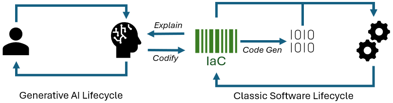

# Intention as Code

While the advancement of AI brings us closer to achieving intuitive computer interactions, a significant hurdle remains - ensuring predictability, consistency, and explainability in their actions. 

IaC introduces a powerful layer of abstraction that codifies users' intentions expressed in natural language. By encoding these intentions, we create a framework for verifying, signing, and packaging them into “classic”, predictable applications. 
What sets IaC apart is its ability to unleash the full potential of generative AI while maintaining control and transparency. With our solution, you can effortlessly create powerful enterprise applications without writing a single line of code. These applications can be explicitly versioned, verified, and managed, ensuring seamless integration with your existing infrastructure. Leveraging AI capabilities, IaC enables continuous improvements and empowers you to stay ahead of the curve.

IaC serves as a means to merge the generative AI development lifecycle with the conventional software lifecycle, creating a seamless and continuous cycle. This integration allows for the application of traditional software practices, tools, and patterns while harnessing the potential of generative AI with assured control and predictability.

Discover the limitless possibilities of IaC and propel your organization into the future of intuitive, explainable computing.

## Read More

* [Sample scenario: Workplace safety - debris detection](./samples/debris-detection/)